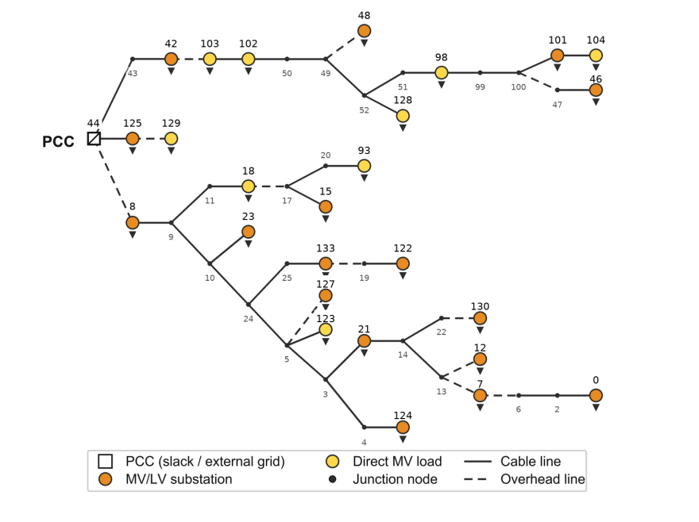

# Flexible Operating Regions for a Swiss MV Distribution Grid



This repository contains the final Python implementation and prepared input data
used to compute multi-timestep Feasible Flexibility Operating Regions (FFORs)
for a synthetic 20 kV medium-voltage distribution grid in Eschenbach SG,
Switzerland.

The project studies how network constraints, future DER deployment, resource
location, and activation duration affect the flexibility that can be delivered
at the point of common coupling (PCC). The code supports scenarios with
additional large-scale photovoltaic (PV) fields, grid-scale battery energy
storage systems (BESS), and physical-line reinforcement.

## Overview

The model builds a linearized distribution-grid optimization problem and uses a
QuickFlex-style boundary search to construct the FFOR at the PCC. The resulting
polygon describes the active and reactive power deviations that can be
sustained over a selected activation horizon while respecting voltage, line,
DER, BESS state-of-charge, and temperature-dependent heat-pump constraints.

The repository is intended as a reproducible final project delivery: it contains
the main modules, prepared data folders, and a compact example run that writes
the FFOR boundary directly to CSV and PNG files.

## Requirements

- Python 3.10 or newer.
- A valid Gurobi license.
- Python packages listed in `requirements.txt`.

Install the required packages from the repository root:

```powershell
pip install -r requirements.txt
```

## Quick Start

1. Check or edit the scenario settings in `config.py`.
2. Ensure that the required grid and profile data are present under `06_Grids/`
   and `outputs/`.
3. Run the model from the repository root:

```powershell
python run.py
```

Each run writes the following files in the repository root, replacing files
from the previous run:

- `ffor_boundary.csv`
- `ffor_boundary.png`

By default, the code looks for data inside this repository. To keep the data
elsewhere, set `FFOR_DATA_ROOT` to the directory containing `06_Grids/` and
`outputs/` before running the model. This supports read-only, authorized, or
cloud-synchronized data locations without editing the Python modules.

The year, target timestamp, timestep count, and timestep duration can also be
set through environment variables:

- `FFOR_DATA_YEAR`
- `FFOR_TARGET_TIME`
- `FFOR_N_TIMESTEPS`
- `FFOR_DT_H`

## Repository Structure

| Path | Purpose |
| --- | --- |
| `config.py` | Scenario, DER, BESS, PV, and reinforcement configuration. |
| `loader.py` | Grid and profile loading utilities. |
| `model_data.py` | Prepared-profile processing and optimization-data assembly. |
| `optimization.py` | Linear multi-timestep FFOR optimization model. |
| `run.py` | QuickFlex boundary calculation and output generation. |
| `requirements.txt` | Python package requirements. |
| `data_checksums_sha256.csv` | Optional SHA-256 manifest for checking prepared data files. |
| `06_Grids/` | Grid topology and electrical data. |
| `outputs/` | Prepared yearly demand, DER, weather, and allocation profiles. |

## Data Layout

Run the code from the repository root and place the prepared data underneath it
using the following structure:

```text
Optimization-in-Energy-Systems/
|-- 06_Grids/
|   |-- 20_0_nodes.txt
|   |-- 20_0_edges.txt
|   |-- 20_0_matpower.xlsx
|   |-- 20_0_bus_data.csv
|   |-- 20_0_branch_data.csv
|   `-- 20_0_grid.xlsx
`-- outputs/
    |-- 20_0_profiles_mveq_evbase_2030/
    |-- 20_0_profiles_mveq_evbase_2040/
    `-- 20_0_profiles_mveq_evbase_2050/
```

Each yearly profile directory requires:

```text
baseline_demand_by_mv_node.csv
hp_baseline_by_mv_node.csv
pv_generation_by_mv_node.csv
ev_baseline_by_mv_node.csv
ev_baseline_q_by_mv_node.csv
bess_allocation_mveq.csv
ffor_inputs/time_columns.csv
ffor_inputs/temperature_profiles.csv
ffor_inputs/hp_mv_allocation.csv
ffor_inputs/hp_lv_allocation.csv
ffor_inputs/pv_mv_generation.csv
ffor_inputs/pv_lv_generation.csv
```

`data_checksums_sha256.csv` records the expected SHA-256 hash of each prepared
data file. It is not required by the simulation, but it should be retained when
the data package is transferred or downloaded so recipients can verify that the
inputs are complete and unchanged.

## Scenario Configuration

The following studies can be configured directly in `config.py`:

- additional grid-scale PV installations through `GRID_SCALE_PV`;
- additional grid-scale BESS installations through `GRID_SCALE_BESS`;
- physical-line reinforcement through `REINFORCED_PHYSICAL_LINES`.

Leave these lists empty to simulate the original grid without additional
grid-scale assets or reinforcement.

**Node-numbering convention:** the topology image above uses the node labels
adopted in the paper. The Python code uses the internal bus IDs from the grid
data, which are one number higher. For example, node `129` in the image
corresponds to code bus `130`.

## Data And Method Sources

The main data and modelling sources used in the project are:

- The synthetic MV electrical grid topology and parameters are taken from
  Oneto et al. (2024), "Large-Scale Generation of Geo-Referenced Power
  Distribution Grids Using Open Data", TechRxiv.
  DOI: `10.36227/techrxiv.24607662.v3`.
- DER deployment data and future scenario profiles for demand, PV, EVs, heat
  pumps, and distributed BESS are taken from Zapparoli et al. (2025), "Future
  Deployment and Flexibility of Distributed Energy Resources in the
  Distribution Grids of Switzerland", Scientific Data.
  DOI: `10.1038/s41597-025-05830-y`.
- Lopez et al. (2021), "QuickFlex: a Fast Algorithm for Flexible Region
  Construction for the TSO-DSO Coordination", SEST 2021.
  DOI: `10.1109/SEST50973.2021.9543349`.
- Arpagaus et al. (2023), "Field experience with residential heat pumps in
  Switzerland: Potential for improvement and future developments", 14th IEA
  Heat Pump Conference.
- Brandle et al. (2025), "On the Flexibility Potential of a Swiss Distribution
  Grid: Opportunities and Limitations", arXiv.
  DOI: `10.48550/arXiv.2510.13449`.
- Council of European Energy Regulators (2001), "Quality of electricity supply:
  Initial benchmarking on actual levels, standards and regulatory strategies".

## Limitations

- The network is an MV-equivalent synthetic Swiss distribution grid derived
  from open data.
- The input profiles are hourly projections for the selected 2030, 2040, and
  2050 scenarios, introducing a degree of uncertainty in the model.
- The optimization uses a first-order linearized power-flow model. It retains
  line resistance, reactance, and shunt susceptance, but does not represent
  nonlinear active-power losses.
- PV and BESS interventions are evaluated independently; coordinated PV-BESS
  operation is not considered.
- BESS units are inactive in the baseline, so the study does not evaluate
  whether BESS corrective dispatch can restore infeasible baseline operating
  points. Furthermore, the initial BESS state of charge is fixed across
  simulations.

## Contributors

- Luca Lazzari - MSc in Energy Science and Technology, ETH Zurich.
- Pierpaolo Musiello - MSc in Energy Science and Technology, ETH Zurich.
- Alessandro Falezza - MSc in Electrical Engineering and Information
  Technology.

## Citing

If you use this repository or the prepared data in further work, please cite
the project and the data and method sources listed above.

## License

No standalone license file is included in this repository at the time of
writing. Please contact the contributors before redistributing or reusing the
code and prepared data outside the project context.
